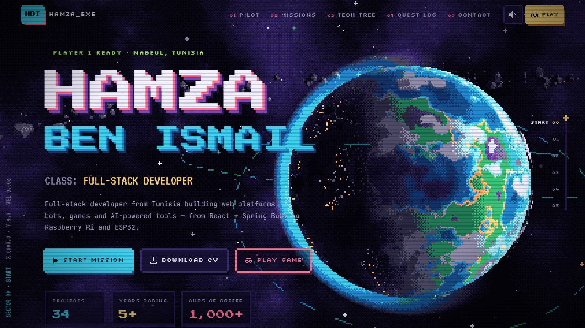

<a href="https://www.hamzabenismail.cloud-ip.cc">
  
</a>

<p align="center">
  <a href="https://www.hamzabenismail.cloud-ip.cc"></a>
  <a href="https://www.linkedin.com/in/hamzabenismail1/"></a>
  <a href="mailto:hamza.benismail.6@gmail.com"></a>
  <a href="https://buymeacoffee.com/naniii"></a>
  <br>
  
</p>

## ▸ 01 // PLAYER PROFILE

```yaml
name:        Hamza Ben Ismail
class:       Full-Stack Developer
origin:      Sfax, Tunisia 🇹🇳
guild:       The Orange Labz — Developer & Community Manager
education:   B.Sc. Computer Science (Software Engineering), Faculty of Sciences of Sfax (2021–2025)
main_quest:  Shipping products end-to-end — web platforms, bots, games, IoT and AI tools
side_quests: [LLMs & AI agents, blockchain games, embedded systems]
fun_fact:    5 years of Pascal before anything modern — begin ... end;
```

I like owning a product from the database to the last pixel. Right now I'm building the **Orange Crush** tap-to-earn game and the **ToLZ** NFT collection at The Orange Labz, where I also run a Discord community of **1,000+ players**. On the side I'm going deep on **LLMs, AI agents and automation**.

## ▸ 02 // LOADOUT

<p align="center">
  <br>
  <br>
  <br>
  
</p>
<p align="center">
  
  
  
  
  
  
  
</p>

## ▸ 03 // FEATURED MISSIONS

<a href="https://www.hamzabenismail.cloud-ip.cc">
  
</a>

<p align="center">
  <b>🪐 HBI-OS — my portfolio.</b> A real-time Three.js universe rendered at low resolution and dithered to a 24-color palette, so the 3D reads as true pixel art.<br>
  It has a scroll-driven camera, procedurally generated sprites, an interactive terminal, a chiptune synth and a hidden arcade game.<br>
  <a href="https://www.hamzabenismail.cloud-ip.cc"><b>▶ Press start</b></a> · <a href="https://github.com/naniiic137/hamza.ben.ismail">Source</a>
</p>

<table>
<tr>
<td width="50%" valign="top">

### 📋 ApplyTrack
Full-stack job-application tracker: drag-and-drop Kanban across 6 statuses, an automatic status timeline, interviews and a stats dashboard. JWT-secured Spring Boot REST API with per-user data isolation, Flyway + PostgreSQL, Docker Compose, 98 automated tests (86% backend coverage) and an end-to-end Docker smoke test in CI.

`Spring Boot` `Java` `React` `TypeScript` `PostgreSQL` `Docker`
<br>[📦 Repo](https://github.com/naniiic137/applytrack)

</td>
<td width="50%" valign="top">

### 🤖 JobFit AI
AI copilot for job applications: CV vs job ad → grounded match score, skill gaps, tailored CV bullets and an EN/FR cover letter. Four pluggable providers (offline, Gemini, Ollama, OpenAI-compatible) behind one zod-validated schema — and every claim must quote the CV. 176 tests, including a golden-set evaluation.

`React` `TypeScript` `LLMs` `Prompt engineering` `zod`
<br>[📦 Repo](https://github.com/naniiic137/jobfit-ai)

</td>
</tr>
<tr>
<td width="50%" valign="top">

### 🔏 CipherChat
End-to-end encrypted real-time chat where the relay server only ever sees ciphertext — and a live "what the server sees" panel proves it. X3DH-style handshake + Double Ratchet, Argon2id passphrases, AES-GCM / ChaCha20 / XChaCha20, signed messages, encrypted files and safety numbers. 257 tests, including RFC test vectors.

`TypeScript` `React` `Node.js` `WebSocket` `Cryptography`
<br>[📦 Repo](https://github.com/naniiic137/cipher-chat)

</td>
<td width="50%" valign="top">

### 🔗 LinkPulse
URL shortener built as a system-design answer: cache-first redirects (~8k/s locally), a Redis Streams → PostgreSQL click pipeline, HyperLogLog unique visitors, atomic Lua rate limits and SSRF protection. 146 tests, run in CI against real PostgreSQL and Redis.

`TypeScript` `Fastify` `Redis` `PostgreSQL` `React`
<br>[📦 Repo](https://github.com/naniiic137/linkpulse)

</td>
</tr>
<tr>
<td width="50%" valign="top">

### 🌫️ Fog Chess
Real-time chess where you can't see the enemy pieces, only that a square is occupied. Secret setups, private guess-pins, and a Chaos mode with fairy pieces on boards up to 10×10. The server enforces full chess rules and sends each player only their fogged view. A reload or dropped connection doesn't end the game (60 s seat hold), with a full reveal at the end and 11 automated tests.

`Node.js` `Socket.io` `Express` `chess.js` `node:test`
<br>[📦 Repo](https://github.com/naniiic137/fog-chess) · <sub>work in progress</sub>

</td>
<td width="50%" valign="top">

### 🔐 ChessCipher
Hides secret messages inside realistic chess positions. A SHA-256 mapping turns characters into squares, the filename reads like real PGN notation, and decoy pieces make the board convincing. Ships as a Python CLI and a browser app.

`Python` `JavaScript` `SHA-256`
<br>[📦 Repo](https://github.com/naniiic137/ChessCipher)

</td>
</tr>
<tr>
<td width="50%" valign="top">

### 🚗 LogiServ
Built during my capstone internship at STEG: a platform to manage and track maintenance interventions on buildings and vehicles. React + TypeScript, Spring Boot microservices, PostgreSQL, Keycloak SSO with LDAP roles, Redis + Firebase notifications, Dockerized behind Nginx.

`React` `TypeScript` `Spring Boot` `Keycloak` `Docker`
<br><sub>🔒 Private repository · Capstone internship at STEG · 04/2025 – 07/2025</sub>

</td>
<td width="50%" valign="top">

### 🍊 Orange Crush · The Orange Labz
A tap-to-earn crypto game and the ToLZ NFT collection, launched on OpenSea. I build game mechanics and backend infrastructure, work on smart-contract integration, and manage a 1,000+ member Discord.

`Game Dev` `Blockchain` `NFT` `Community`
<br>[🎮 Play](https://orangecrush.app/game) · [🏢 Studio](https://theorangelabz.com)

</td>
</tr>
<tr>
<td width="50%" valign="top">

### 📟 PicoPulse
Live telemetry from a Raspberry Pi Pico to a browser dashboard over USB — MicroPython firmware streaming a versioned JSON protocol, read with the Web Serial API. Live canvas charts, alerts, device control, and a simulator so anyone can try it.

`MicroPython` `Raspberry Pi Pico` `TypeScript` `Web Serial`
<br>[📦 Repo](https://github.com/naniiic137/picopulse)

</td>
<td width="50%" valign="top">

### 🎭 Kalak (كلك)
Real-time multiplayer party game for phones: write a fake answer to a trivia question, then spot the real one among your friends' bluffs. Server-authoritative state machine, 325 questions, full Arabic/English interface with RTL. Reload-proof seats, merged duplicate bluffs and 23 automated tests.

`Node.js` `Socket.io` `Express` `node:test`
<br>[📦 Repo](https://github.com/naniiic137/Kalak)

</td>
</tr>
</table>

<details>
<summary><b>➕ More missions</b></summary>
<br>

| Mission | What it does | Stack |
|---|---|---|
| [Websites for Businesses](https://websites-preview.netlify.app) | 14 complete client-style sites (restaurant, clinic, car rental, gym, salon, travel, shop, hotel, inventory app…) — responsive and offline-ready | HTML · CSS · JS |
| [Chkoba](https://github.com/naniiic137/Chkoba) | The Tunisian card game online: play a bot or 2–4 friends in real time | JS · Firebase |
| [Custom Wordle V2](https://github.com/naniiic137/CustomWordleV2) | Puzzle creator with 33 modes and encrypted share links | JS · Web Crypto · Netlify |
| [Intern Manager](https://github.com/naniiic137/Employer-Manager) | Desktop app built during my Tunisie Telecom internship to manage intern records | Lazarus · SQLite |
| [Custom Checkers](https://github.com/naniiic137/Custom-Checkers) | Checkers with 6 king modes, a board editor, shareable rule links and P2P multiplayer | JS · WebRTC |
| [Meme Guardian Bot](https://github.com/naniiic137/Discord-moderation-bot) | Discord moderation: daily limits, cooldowns, lockdowns, an admin dashboard | Node.js · Discord.js |
| [Game Update Bot](https://github.com/naniiic137/game-update-bot) | Watches Fortnite, VALORANT & CS2 versions and pings Discord — free, via Actions cron | Python · GitHub Actions |
| [MicroSaving](https://github.com/naniiic137/MicroSaving) | Gamified savings plans as a PC dashboard, an installable PWA and printable sheets | Python · PWA |
| [Ball Simulation](https://github.com/naniiic137/ball_simulation) | Physics battle sandbox with in-game Python scripting for damage logic | Python · Pygame |
| [Dice Game](https://github.com/naniiic137/Dice_Game) | Roll until all six dice match — web app with a global leaderboard, plus a desktop version | Flask · Pygame |
| [Simple Inventory](https://github.com/naniiic137/simple-inventory) | Desktop sales & inventory manager with CSV export and cloud-synced SQLite | Python · ttkbootstrap |

<p align="center"><a href="https://github.com/naniiic137?tab=repositories">🔍 Browse all repositories →</a></p>
</details>

## ▸ 04 // QUEST LOG

| Status | Quest | Guild | When |
|:---:|---|---|---|
| ▶️ | **Developer & Community Manager** — Orange Crush game, ToLZ NFTs, 1,000+ community | The Orange Labz | 2025 – present |
| ✅ | **Capstone Intern — Full-Stack Developer** — built LOGISERV, a maintenance-intervention platform | STEG | 04/2025 – 07/2025 |
| ✅ | **B.Sc. Computer Science** — Software Engineering | Faculty of Sciences of Sfax | 2021 – 2025 |
| ✅ | **Pascal Programming** — 5 years of algorithms & logic | Education | 2019 – 2024 |
| ✅ | **Software Development Intern** — [intern management desktop app](https://github.com/naniiic137/Employer-Manager) (Lazarus + SQLite) | Tunisie Telecom | 08/2022 – 09/2022 |

## ▸ 05 // STATS

<p align="center">
  
  
  <br>
  
</p>

## ▸ 06 // OPEN CHANNEL

<p align="center">
  Always open to new opportunities and interesting collaborations — AI agents, crypto games, embedded systems,<br>
  or a round of Chkoba. 🃏 The fastest way to reach me is <a href="mailto:hamza.benismail.6@gmail.com"><b>hamza.benismail.6@gmail.com</b></a>.
</p>

<a href="https://www.hamzabenismail.cloud-ip.cc">
  
</a>
